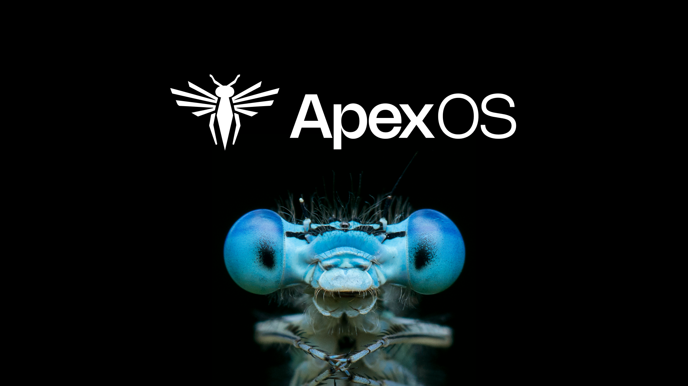

# ApexOS Dotfiles

Welcome to the ApexOS dotfiles repository! This repository contains my personal configuration files, optimized for my workflow.



## Features

- [DETAILS COMING SOON]

## Shell Aliases

- `nixup`: Rebuild the system configuration.
- `homeup`: Rebuild the home configuration.

## Installation

1. Download the minimal [NixOS ISO](https://channels.nixos.org/nixos-24.05/latest-nixos-minimal-x86_64-linux.iso), flash it onto a storage medium, and boot into it.
2. Set up your partitions.
3. Format the partitions.
4. Mount the partitions.
5. Clone this repository into `/home/[username]/dots`.
6. Update the `nh` flake location accordingly.
7. Add your user.
8. Generate your hardware configuration and append any specific hardware settings to the `hosts` directory.
9. Add your host entry to the `flake.nix` file.
10. Install the system using:
   ```bash
   nixos-install --flake /mnt/home/[username]/dots#[host]